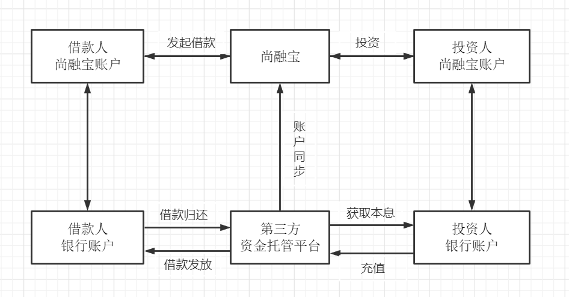
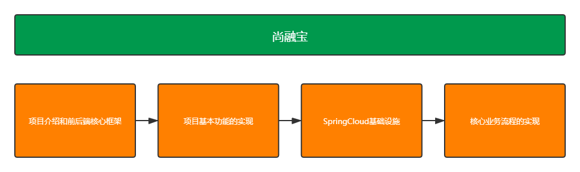
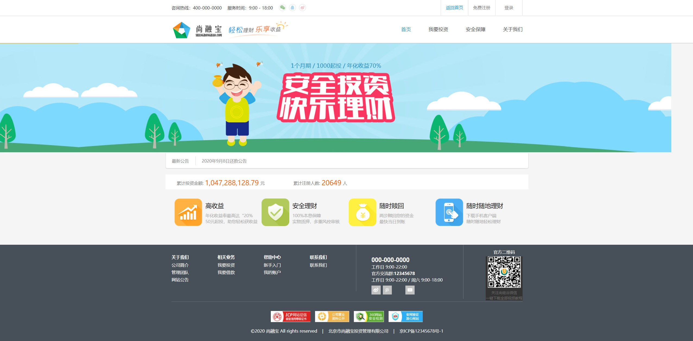

# 一、项目简介
尚融宝是一个网络借贷信息中介服务平台，为个人投资者、个人融资用户和小微企业提供专业的线上信贷及出借撮合服务。
行业案例：人人贷 https://www.renrendai.com/、拍拍贷 https://www.paipaidai.com/

# 二、信用贷款平台的类别

## 1、银行系

- 优势：第一，资金雄厚，流动性充足；第二，项目源质地优良，大多来自于银行原有中小型客户；第三，风险控制能力强。如恒丰银行、招商银行等旗下都有信用贷款平台。
- 劣势：收益率偏低，预期年化收益率处于5.5%-8.6%之间，略高于银行其他理财产品，对投资人吸引力有限。

## 2、国资系

- 优势：拥有国有背景股东的隐性背书，兑付能力有保障，业务模式较为规范，从业人员金融专业素养较高。
- 劣势：缺乏互联网基因；项目标的较大，起投门槛较高；且产品种类有限，多为企业信用贷；较为谨慎，层层审核的机制严重影响了平台运营效率；收益率不具有吸引力。

## 3、民营系

民营系平台数量最多，起步最早，但鱼龙混杂，不胜枚举。

- 优势：普惠金融，手续便捷；门槛极低，投资起点低最低起投门槛甚至50元；强大的互联网思维，产品创新能力高，市场化程度高；收益率高，投资收益率具有吸引力。
- 劣势：风险偏高，资本实力及风控能力偏弱，跑路及倒闭的高发区。

# 三、业务流程

## 1、投资人

希望在平台上找到合适的投资项目，获取利润回报的用户

## 2、借款人

需要资金周转的用户

## 3、资金池风险

- 资金池：一个大池子放钱，一边存进来（入水管），一边贷出去（出水管）。不管是张三的钱、李四的钱、还是王五的钱，只要进到池子里，就都叫池子的钱了。银行就是典型的资金池。

- 资金池风险：

- - 第一种情况：投资入水管流量过大，池子里全是水。这种情况，平台亏钱，干不长。原因很简单，池子里的钱是有成本的，只进不出，没有利差，拿什么钱付投资人的利息，时间长了，就只能用投资人的本金还投资人的利息，借新还旧，庞氏骗局。这个过程就直接背离了平台信息中介的身份，而成了与银行类似的金融机构。
  - 第二种情况：突然来了这么多钱，怎么办？只能把放贷出水管的流量调大。放贷的这条出水管上有两个阀门，一个叫找项目，一个叫做风控。遇到这种情况，经常就是两个阀门一块儿放，钱是贷出去了，但由于放松了对风险的把控，能不能再流回来，就不好说了，危险。
  - 第三种情况：提款的出水管流量变大。比如，一个黑天鹅事件，一个负面新闻，一个平台垮了，都可能诱发这种情况，这就是挤兑。比如说某租宝事件后，不只这一家平台，很多其他平台的用户，也在疯狂的提现，有可能一直提到关门为止。
  - 第四种情况最极端：平台把池子里的钱都提出来，走人。这个就不用解释了，就是跑路。
  - 以上四种情况就是资金池最主要的几个风险——经营不善，风险失控，挤兑和跑路。银监会发布的《网络借贷信息中介机构业务活动管理暂行办法》让资金存管成为网贷平台的硬性要求，同时降低了平台建立资金池、挪用用户资金的风险。

## 4、资金托管平台

- 第三方存管模式：“第三方存管”的全称是“客户交易结算资金第三方存管”。这里的第三方存管机构，目前是指具备第三方存管资格的商业银行。银行的流入资金成本低，风控体系较完善，资金池子足够大，而且是国家背书，不会跑路。
- 说明：由于我们是教学使用，无法申请到正式的资金托管平台的支持，所以我们根据资金托管平台API接口文档，自行开发模拟一套API接口来满足业务需要，业务过程与实际开发基本一致。

# 三、课程介绍

# 四、项目架构

# 五、项目功能演示
## 1、后台管理系统

## 2、前台网站系统

# 六、业务流程总结

# 七、开发环境和工具
## 一、前置知识

Java基础、HTML、CSS、JavaScript、Spring、SpringMVC、MyBatis、SpringBoot、SpringCloud Alibaba
MySQL、Redis、RabbitMQ、nginx、idea、maven、VMWare 虚拟机、CentOS 操作系统

## 二、技术栈

### 1、后端

- SpringBoot 2.3.4.RELEASE
- SpringCloud Hoxton.SR8：微服务基础设施 - 服务注册、服务发现、服务熔断、微服务网关、配置中心等
- SpringCloud Alibaba 2.2.2.RELEASE
- MyBatis Plus：持久层框架和代码生成器
- Lombok：简化实体类开发
- Swagger2：Api接口文档生成工具
- Logback：日志系统
- alibaba-easyexcel：Excel读写
- Spring Data Redis：Spring项目中访问Redis缓存
- HTTPClient: 基于Http协议的客户端，用来实现远程调用
- Spring Task：定时任务

### 2、数据库和中间件

- MySQL 5.7：关系型数据库     
- 管理工具：Navicat
- Redis 5.0：缓存技术     
- 管理工具：RedisDesktopManager
- RabbitMQ 3.8：消息中间件

### 3、三方接口

- 阿里云短信：短信网关
- 阿里云OSS：分布式文件存储
- 资金托管平台API对接：汇付宝

### 4、前端

- Node.js： JavaScript 运行环境
- ES6：JavaScript的模块化版本
- axios：一个发送Ajax请求的工具
- Vue.js：web 界面的渐进式框架
- Element-UI：前端组件库
- 模块化开发：解决javascript变量全局空间污染的问题
- NPM：模块资源管理器
- vue-element-admin：基于Vue.js的后台管理系统UI集成方案
- NuxtJS：基于Vue.js构建的服务器端渲染应用的轻量级框架

## 三、开发环境检查

- jdk 1.8
          配置：JAVA_HOME、path
- maven 3.6
          配置：MAVEN_HOME、本地仓库路径、中央仓库地址、jdk版本
- ideaIU-2020.2.3：
          注意：在idea的欢迎页面选择Configure > settings
          配置：Java Compiler、File Encodings、Maven、Auto Import、Code Completion > Match case（取消）
          插件：lombok、MyBatisX

# 八、笔记

## 1、安装和注册

为知笔记

## 2、笔记的使用

笔记目录设置、笔记导入、笔记视图、笔记显示顺序、笔记编辑

# 九、项目部署

后期更新...

